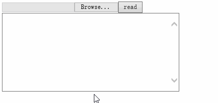
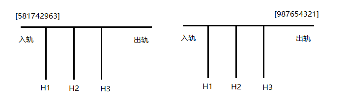
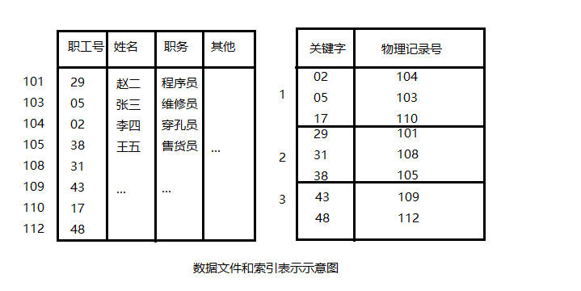

# csharp_function
### 1.OperateFile
操作文件：创建 删除 查找并打开 移动 复制 重命名 追加内容
### 2.OperateDirectory
操作文件夹：创建 删除 移动 复制 重命名 计算文件夹下子文件和子文件夹的个数 按文件名称排列顺序 压缩 解压缩
### 3.OperateCmd
操作cmd命令提示符，操作其他程序的运行与停止
### 4.XmlDOM
DOM方法操作xml文件：创建xml文件 查找节点或属性 增加节点或属性 删除节点或属性 修改节点或属性 替换节点或属性 移动或复制节点到当前文件
### 5.XmlLinq
linq方法操作xml文件：创建xml文件 读取xml文件 查找节点或属性 增加节点或属性 删除节点或属性 修改节点或属性 替换节点或属性 移动或复制节点到当前文件 复制节点到其他xml文件
### 6.PowByHand
模拟手算m^n的实现方法

# javascript function
### 1.word_follow_mouse  
　　
### 2.editDIV_and_limitnumber  
　　
### 3.dragpicture_innerparent  
　　
### 4.rotating_appear  
　　
### 5.mouseon_emerge  
　　
### 6.readExcel_IE  
　　

# csharp-data_structure_basis
### 1.问题描述
　　有一个学生表，以升序的方式存储着N位学生的成绩，表头分别为学号、姓名、考试成绩，根据这些学生成绩编写一个学生成绩管理系统。
**基本要求**
　　对学生成绩表，不论时插入还是删除学生成绩，都要保证成绩按照升序排列。      
　　可以按给定的姓名或学号查询指定学生的成绩。      
　　可以按升序或降序显示所有学生的成绩。
**实现方法**
　　List-StudentResult 学生成绩管理系统的链表实现    

### 2.问题描述
　　对某电文（字符串）进行加密，形成密码文（字符串）。假设原文为C1C2C3…Cn,加密后产生的密文为S1S2S3…Sn。首先读入一个正整数key(key>1)作为加密钥匙，并将密文字符位置按顺时针方向连成一个环。加密时从S1位置起顺时针方向计数，当数到第key个字符位置时，将原文中的字符C1放入该密文字符位置，同时从环中除去该字符位置。接着，从环中下一个字符位置起继续计数，当再次数到第K个字符位置时，将原文中的C2放入其中并从环中除去该字符位置，依此类推，直至n个原文字符全部放入密文环中。由此产生的S1S2S3…Sn即为原文的密文。
**基本要求**
　　动态输入原文的内容。      
　　动态输入key的值，对于每一个key，在屏幕上产生原文内容及密文内容。
**实现方法**
　　List-JosephPermutation 约瑟夫环的链表实现    

### 3.问题描述
　　一列货运列车共有n节车厢，每节车厢将停放在不同的车站。假定n个车站的编号分别为1-n，货运列车按照第n站至第1站的次序经过这些车站。车厢的编号与它们的目的地相同。为了便于从列车上卸掉相应的车厢，必须重新排列车厢，使各车厢从前至后按编号1-n的次序排列。当所有的车厢都按照这种次序排列时，在每个车站只需要卸掉最后一节车厢即可。我们在一个转轨站李完成车厢的重排工作，在转轨站中有一个入轨、一个出轨和k个缓冲铁轨（位于入轨和出轨之间）。下图给出了一个转轨站，其中有k=3个缓冲铁轨H1、H2、H3。开始时，n节车厢的火车从入轨处进入转轨站，转轨结束时各车厢从右到左按编号1至编号n的次序离开转轨站（通过出轨处）。在下图中，n=9，车厢从后至前的初始次序为581742963，出轨后为按要求的次序重新排列为987654321。      
　　
**基本要求**
　　编写算法实现火车车厢的重排。      
　　编写程序模拟上图具有9节车厢的火车入轨和出轨的过程。
**实现方法**
　　SequenceStack-RearrangementOfTrainCarriages 火车车厢重排的顺序栈实现      
　　LinkedStack-RearrangementOfTrainCarriages 火车车厢重排的链栈实现

### 4.问题描述
　　汉诺塔问题来自于一个古老的传说：在世界刚被创造的时候，有一座钻石宝塔（A），其上有64个金碟。所有的碟子按从大到小的次序从塔底堆放至塔顶。紧挨着这座塔有另外两个钻石宝塔（B和C）。从世界创始之日起，婆罗门的牧师们就一直在试图把A上的碟子移动到B上去，其间借助于C的帮助。由于碟子非常重，因此，每次只能移动一个碟子。另外，任何时候都不能把一个碟子放在比它小的碟子上面。按照这个传说，当牧师们完成他们的任务之后，世界末日也就到了。
　　在汉诺塔问题中，已知n个碟子和3座塔。初始时所有的碟子按从大到小的次序从塔A的塔底堆放至塔顶，现在需要把所有碟子都移动到B塔，每次移动一个碟子，而且任何时候都不能把大碟子放到小碟子上面。
**基本要求**
　　编写一算法实现将A塔上的碟子移动B塔上，大碟在下，小碟在上。    
　　将移动的过程显示出来。
**实现方法**
　　ArrayRecursion-TowersOfHanoi 汉诺塔的数组递归方法    
　　StackRecursion-TowersOfHanoi 汉诺塔的栈递归方法    
　　Stack-TowersOfHanoi 汉诺塔的栈非递归方法

### 5.问题描述
　　目前，在以银行营业大厅为代表的窗口行业，大量客户的拥挤排队已成为了这些企事业单位改善服务品质、提升企业形象的主要障碍。排队（叫号）系统的使用成为改变这种状况的有力手段。排队系统完全模拟了人群排队全过程，通过取票进队、排队等待、叫号服务等功能，代替了人们站队的辛苦，把顾客排队等待的烦恼变成一段难得的休闲时光。      
　　排队叫号软件的具体操作流程为：      
　　顾客取服务序号：当顾客抵达服务大厅时，前往放置在入口处旁的取号机，并按一下其上的相应服务按钮，取号机会自动打印出一张服务单。单上显示服务号及该服务号前面正在等待服务的人数。       
　　服务员工呼叫客户：服务员工只需要按一下其柜台上呼叫器的相应按钮，则顾客的服务号就会按顺序地显示在显示屏上，并发出“叮咚”和相关语音信息，提示该顾客前往该窗口办事。当一位顾客办理完毕后，柜台服务员工只需按呼叫器相应按钮，即可自动呼叫下一位顾客。      
　　编写程序模拟上面的工作过程
**基本要求**
　　程序运行后，当看到“请点击触摸屏获取号码”的提示时，只需按任一键，即可显示“您的号码是：XXX，你前面有YYY位”的提示，其中XXX是所获取的服务号，YYY是在XXX之前来到的正在等待服务的人数。      
　　用多线程技术模拟服务窗口（可模拟多个），具有服务员工呼叫顾客的行为，假设每个顾客服务的时间为10000ms，时间到后，显示“请XXX号到ZZZ号窗口！”的提示。其中ZZZ时即将为客户服务的窗口号。
**实现方法**
　　Queue-BankQueuingSoftware 银行排队叫号软件的队列实现   

## 6.问题描述
　　假设在周末舞会上，男士们和女士们进入舞厅时，各自排成一对。跳舞开始时，依次从男队和女队的队头上各出一人配成舞伴。若两队初始人数不同，则较长的那一队中未配对者等待下一轮舞曲。编写程序，模拟该场景。
**基本要求**
　　模拟男士们和女士们进入舞厅排队的场景。      
　　写一算法模拟上述舞伴配对过程。      
　　显示一场舞会男女舞伴搭配记录。
**实现方法**
　　Queue-Dance 跳舞排队的队列实现    

### 7.问题描述
　　磁盘文件中的数据一般时按记录方式组织的。一条记录由许多字段组成，其中一个就是键字段。如下左图所示的数据文件，它由很多记录组成，每条记录由职工号、姓名、职务等字段组成，其中职工号为每条记录的主键、这个键字段被用于唯一地标识文件中的每个职工的记录。对这个表常有的操作时查询、添加、修改和删除。      
　　为了对数据文件中的记录进行查询、修改和删除操作，首先要定位所要操作的记录。定位的第一种方式就是从文件的第一条记录开始找，直到发现需要的记录。这也就是顺序访问。在这种情况下，如果记录位于文件的末尾，搜索过程将十分耗时。因此必须寻找一种新的方法，以使访问记录能通过指定的键值来完成。      
　　想到在日常生活中，人们常会借助各种索引（如图书资料索引、词典索引等）快速找到所需要的东西，同样也可以为数据文件建立索引表。索引表由关键字及与记录一起存放的物理地址两项组成。如下右图所示，索引应该按升序排序键值段中的值，为了访问一条特定的记录，需要指定它的键值。如果键值存在于索引表中，就提取相应条目的物理位置，在获取了记录的物理位置后，就可以直接从文件中访问那条记录了。假设需要访问职工号为38号的记录，需要搜索索引表来寻找这个键值，并获取相应的物理地址105，这样就可以从物理地址105处开始访问所要读取的记录了。      
　　索引表一般和数据文件同时写入到磁盘中，这样当访问数据时就可以使用索引。当由新记录插入或删除文件时，索引也会同时更新。当文件被打开执行插入、删除或搜索操作时，索引就会被载入到主内存中。要保存在主内存中，索引必须按特定的数据结构来存储。      
　　
**基本要求**
　　选择一种数据结构在内存中存放索引表，通过该数据结构能高效地插入、删除和搜索索引表。      
　　输入任一关键字，显示处查询该关键字的路径。
**实现方法**
　　BinaryTree-QuickSearchDisk 快速搜索磁盘文件中记录的二叉树实现    

### 8.问题描述
　　某超级市场正在开展一项关于顾客购买物品品种的研究。为了完成这项研究，收集了1000个顾客的购物数据，这些数据被组织成一个矩阵purchases，其中purchases(i,j)表示顾客所购买的商品i的数量。      
　　超级市场有一个10000&times;1的价格矩阵price，price(i)代表商品i的单价。矩阵spent=purchasesT&times;price是一个1000&times;1的矩阵，它给出每个顾客所话费的购物金额。
**基本要求**
　　寻找一种节省空间的方式，将矩阵存储到内存中。      
　　当超市管理员输入一顾客编号，即算出该顾客所花费的购物金额。      
　　可以实现矩阵的转置，使得行表示顾客，列表示产品。
**实现方法**
　　Sparse-SupermarketItemPurchaseData 超市物品购买数据的稀疏矩阵实现    
